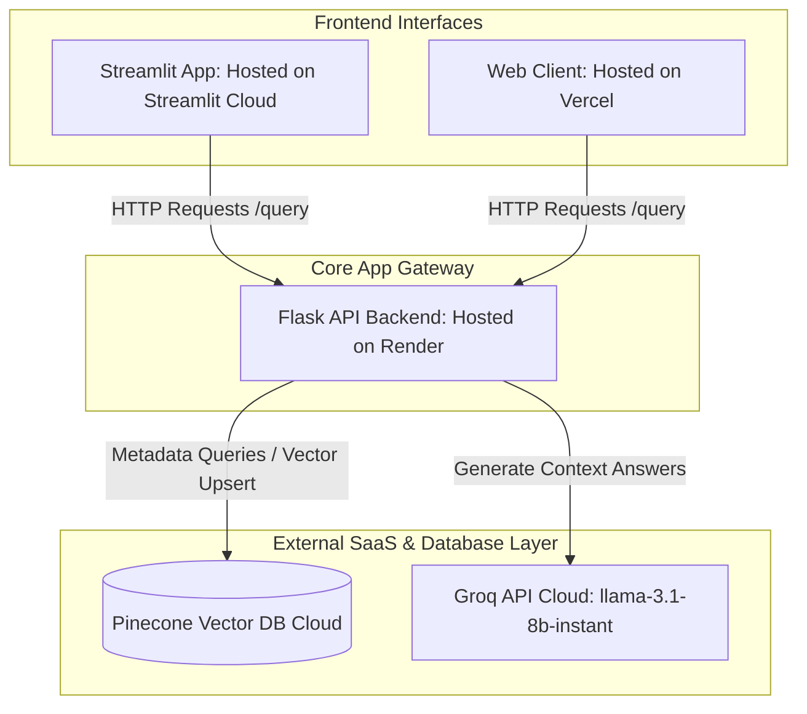

# Deployment Guide: Decoupled Multi-Platform Architecture
## (Streamlit/Vercel + Render + Pinecone)

This guide details the deployment of the **Semantic Search System** in a fully production-grade, decoupled cloud architecture:
* **Frontend:** Deployed to **Vercel** (Static/Next.js client) or **Streamlit Community Cloud** (Python interactive client).
* **Backend:** Deployed to **Render** as a web service.
* **Vector Database:** Hosted on **Pinecone** (Fully serverless external vector database).

---

## 📋 Table of Contents
1. [Architectural Diagram](#1-architectural-diagram)
2. [Database Provisioning (Pinecone)](#2-database-provisioning-pinecone)
3. [Backend API Deployment (Render)](#3-backend-api-deployment-render)
4. [Frontend Deployments](#4-frontend-deployments)
   * [Option A: Streamlit Community Cloud](#option-a-streamlit-community-cloud)
   * [Option B: Vercel Static Web Hosting](#option-b-vercel-static-web-hosting)
5. [Unified Configuration Settings (Environment Variables)](#5-unified-configuration-settings-environment-variables)
6. [Monitoring & Troubleshooting](#6-monitoring--troubleshooting)

---

## 1. Architectural Diagram



---

## 2. Database Provisioning (Pinecone)

Instead of a local, transient SQLite ChromaDB database, this setup uses **Pinecone** to scale the semantic search embeddings vector storage.

### 2.1. Create Pinecone Index
1. Log in to your [Pinecone Console](https://console.pinecone.io).
2. Click **Create Index**.
3. **Configure Index Settings:**
   * **Index Name:** `semantic-search-index`
   * **Dimensions:** `384` (This must match the dimensional output of the `sentence-transformers/all-MiniLM-L6-v2` embedding model).
   * **Metric:** `cosine`
   * **Project Type:** Select `Serverless` (Recommended: choose `us-east-1` or the region closest to your Render server).
4. Copy your **API Key** and **Host URL** (e.g., `https://semantic-search-index-xxxx.svc.us-east1-aws.pinecone.io`) from the index settings dashboard.

---

## 3. Backend API Deployment (Render)

The Flask application processes files and coordinates LLM prompting.

### 3.1. Code Modifications for Pinecone Integration
Ensure the backend vector service imports and uses the `pinecone` client instead of `chromadb`.
* Install the Pinecone Python client in `requirements.txt`:
  ```text
  pinecone-client>=3.0.0
  ```

### 3.2. Deploy Backend on Render
1. Log in to [Render Dashboard](https://dashboard.render.com).
2. Click **New** > **Web Service** and link your Git repository.
3. **Set Build Settings:**
   * **Runtime:** `Docker` (or `Python`)
   * **Build Command (if using Python):** `pip install -r requirements.txt`
   * **Start Command (if using Python):** `gunicorn --bind 0.0.0.0:5000 backend.app.main:app`
4. **Environment Variables Configuration (Critical):**
   Configure the variables under **Settings** > **Environment Variables**:
   * `GROQ_API_KEY`: *Your Groq API key*
   * `PINECONE_API_KEY`: *Your Pinecone access credential key*
   * `PINECONE_INDEX_NAME`: `semantic-search-index`
   * `TESSERACT_CMD`: `/usr/bin/tesseract` (Tesseract default path on Linux containers)
5. **CORS Settings:**
   Ensure `CORS(app)` is configured in `main.py` to allow cross-origin requests originating from your Streamlit or Vercel domains.

---

## 4. Frontend Deployments

You can choose to deploy either a Streamlit dashboard or a static Vercel client.

### Option A: Streamlit Community Cloud

Streamlit is ideal for deploying Python-based analytics interfaces.

1. **Create Streamlit Entrypoint (`app.py`):**
   Create a fast frontend app interface at the repository root level:
   ```python
   import streamlit as st
   import requests

   BACKEND_URL = st.secrets.get("BACKEND_URL", "http://localhost:5000")

   st.title("Document Intelligence platform")

   # File Uploader
   uploaded_files = st.file_uploader("Upload files", accept_multiple_files=True)
   if st.button("Ingest Documents") and uploaded_files:
       for file in uploaded_files:
           res = requests.post(f"{BACKEND_URL}/upload", files={"file": file})
           st.write(f"Queued: {file.name}")

   # Query Box
   query = st.text_input("Enter Question:")
   if st.button("Ask AI") and query:
       res = requests.post(f"{BACKEND_URL}/query", json={"query": query}).json()
       st.subheader("Answer:")
       st.write(res.get("answer"))
       st.subheader("Citations:")
       st.json(res.get("citations"))
   ```
2. **Deploy on Streamlit:**
   * Connect your GitHub repo to [Streamlit Community Cloud](https://share.streamlit.io/).
   * Under project **Settings** > **Secrets**, define:
     ```toml
     BACKEND_URL = "https://your-backend-url.onrender.com"
     ```

### Option B: Vercel Static Web Hosting

Vercel is optimal for static HTML pages or React/Next.js single-page frontends.

1. **Deploy Frontend Folder:**
   * Point Vercel to your repository.
   * If serving standard static HTML, set the **Root Directory** to `backend/app/templates/` or copy the HTML file to a root-level `/public` folder.
2. **Configure Backend URL:**
   * Update the `fetch()` route targets inside the frontend JavaScript script block to reference the Render backend endpoint instead of relative root routes (e.g. change `/query` to `https://your-backend-url.onrender.com/query`).

---

## 5. Unified Configuration Settings (Environment Variables)

Here is a summary of the required configurations across each platform:

| Component | Target Platform | Environment Key | Purpose |
| :--- | :--- | :--- | :--- |
| **Backend API** | Render | `GROQ_API_KEY` | Authenticates Chat model inference. |
| **Backend API** | Render | `PINECONE_API_KEY` | Authenticates Pinecone read/write commands. |
| **Backend API** | Render | `PINECONE_INDEX_NAME` | Specifies the Pinecone index namespace. |
| **Frontend** | Streamlit / Vercel | `BACKEND_URL` | Specifies the Render server target URL. |

---

## 6. Monitoring & Troubleshooting

* **CORS Blocked Responses:** If the frontend console displays CORS errors, ensure `CORS(app)` in [main.py](file:///d:/SemanticSearchSystem/backend/app/main.py) allows requests from Streamlit (`*.streamlit.app`) or Vercel (`*.vercel.app`) subdomains.
* **Vector Query Failures:** Ensure the Pinecone index is configured with exactly **384 dimensions**. Configuring an incorrect number of dimensions will cause embedding lookup tasks to fail.
* **Cold Start Lag:** Free-tier services on Render spin down after inactivity. The first API call from your frontend may take 30-50 seconds to respond as the Render container boots up and reloads the sentence-transformers model.
