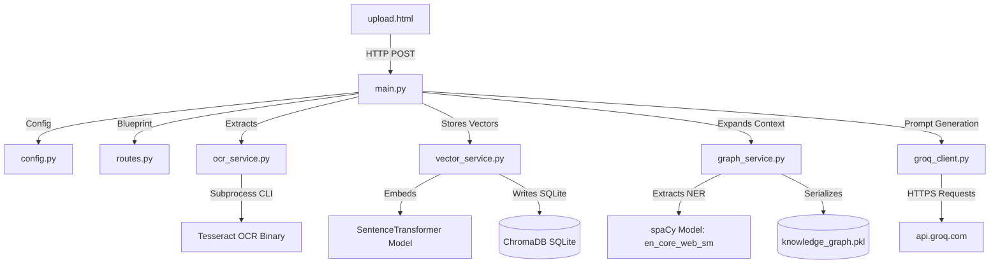
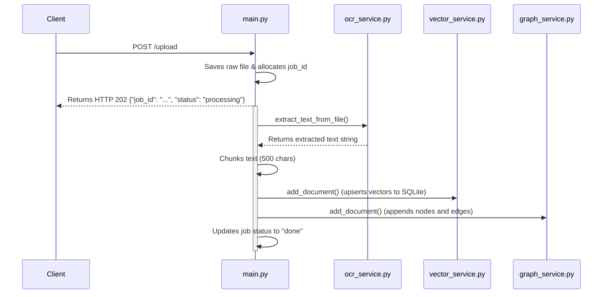
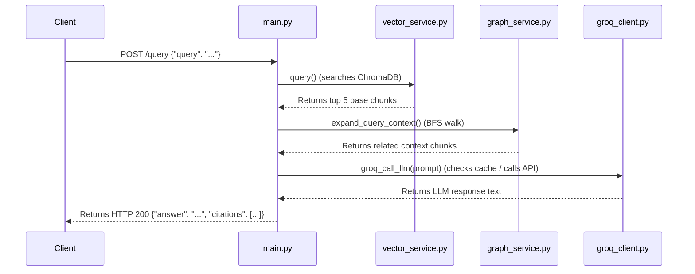

# Enterprise Technical Handover Handbook & Architecture Review
## Semantic Search System (Graph-RAG Document Intelligence Platform)

---

## 📋 Table of Contents
1. [Repository Discovery & Inventory](#1-repository-discovery--inventory)
2. [Project Understanding Report](#2-project-understanding-report)
3. [Dependency Mapping & Diagrams](#3-dependency-mapping--diagrams)
4. [Component & Codebase Analysis](#4-component--codebase-analysis)
5. [Runtime & Request Lifecycles](#5-runtime--request-lifecycles)
6. [Architectural Reconstruction](#6-architectural-reconstruction)
7. [Operational & Troubleshooting Guide](#7-operational--troubleshooting-guide)

---

## 1. Repository Discovery & Inventory

### 1.1. Directory Tree
```
SemanticSearchSystem/
├── .github/
│   └── workflows/
│       ├── main_handwrittenequationsolver.yml
│       └── main_semanticsearchsystem.yml
├── backend/
│   ├── app/
│   │   ├── services/
│   │   │   ├── __init__.py
│   │   │   ├── graph_service.py
│   │   │   ├── groq_client.py
│   │   │   ├── ocr_service.py
│   │   │   └── vector_service.py
│   │   ├── templates/
│   │   │   └── upload.html
│   │   ├── __init__.py
│   │   ├── config.py
│   │   ├── main.py
│   │   └── routes.py
│   ├── data/
│   │   ├── chroma_db/
│   │   │   └── chroma.sqlite3
│   │   ├── .gitkeep
│   │   ├── deployment_redis.md
│   │   ├── Image_to_PDF_20260323_15.24.53.pdf
│   │   ├── Image_to_PDF_20260323_15.29.52.pdf
│   │   ├── knowledge_graph.pkl
│   │   ├── Python_Notes.pdf
│   │   └── test.txt
│   ├── __init__.py
│   └── Dockerfile
├── docs/
│   ├── deployment_guide.md
│   └── documentation.md
├── tests/
│   └── test_app.py
├── .env
├── .gitignore
├── Dockerfile
├── pytest.ini
├── railway.toml
├── README.md
├── render.yaml
├── requirements.prod.txt
└── requirements.txt
```

### 1.2. File Inventory

| File Path | Technology | Classification | Core Purpose |
| :--- | :--- | :--- | :--- |
| `backend/app/main.py` | Python / Flask | **Critical** | Server bootstrap, endpoint registration, daemon thread allocation. |
| `backend/app/config.py` | Python / dotenv | **Critical** | Environment configuration loading and variable normalization. |
| `backend/app/routes.py` | Python / Flask | **Important** | API blueprints registration and service health endpoints. |
| `backend/app/services/ocr_service.py` | Python / PyMuPDF / Tesseract | **Critical** | Text and layout parser for PDFs, DOCX, TXT, and Images. |
| `backend/app/services/vector_service.py` | Python / ChromaDB | **Critical** | Handles SentenceTransformer embeddings and indexing within ChromaDB. |
| `backend/app/services/graph_service.py` | Python / NetworkX / spaCy | **Critical** | Executes spaCy NER & prompts LLMs to extract KG relationships. |
| `backend/app/services/groq_client.py` | Python / Requests | **Critical** | Interface to Groq Cloud API; features rate-limit retry logic and caching. |
| `backend/app/templates/upload.html` | HTML5 / CSS3 / JavaScript | **Important** | Browser UI for upload progress visualization and querying. |
| `tests/test_app.py` | Python / Pytest | **Important** | Functional test suite validating ingestion status, vector space search, and RAG routes. |
| `requirements.txt` | Pip Requirements | **Critical** | Declares standard dependencies and version locks. |

---

## 2. Project Understanding Report

### 2.1. Business Purpose
The **Semantic Search System** resolves organizational challenges associated with querying unstructured textual documents. Unlike regular pattern matching, this system builds a hybrid retrieval framework:
* **Dense Semantic Matching:** Mapping visual and textual documents into vector spaces.
* **Relational Context (Graph RAG):** Tracking entity interactions across documents using a local NetworkX Knowledge Graph.

### 2.2. Core Workflows
1. **Document Upload & Extraction:**
   Files are received at `/upload` (handled by [main.py](file:///d:/SemanticSearchSystem/backend/app/main.py)), saved temporarily, and handed to background daemon threads. The text is parsed via PyMuPDF or Tesseract OCR (handled by [ocr_service.py](file:///d:/SemanticSearchSystem/backend/app/services/ocr_service.py)).
2. **Hybrid Indexing:**
   Chunks of 500 characters are embedded via SentenceTransformer (handled by [vector_service.py](file:///d:/SemanticSearchSystem/backend/app/services/vector_service.py)) and stored in ChromaDB. Simultaneously, entities are processed via spaCy and relation triples are resolved to construct structural links (handled by [graph_service.py](file:///d:/SemanticSearchSystem/backend/app/services/graph_service.py)).
3. **Graph-Augmented Retrieval & Inference:**
   Query requests trigger initial ChromaDB cosine similarity queries. The query terms are then processed through spaCy to walk graph connections up to 1-hop away. Discovered entity chunks are appended to the context. A unified prompt is built and sent to the Groq Cloud API (`llama-3.1-8b-instant`) via [groq_client.py](file:///d:/SemanticSearchSystem/backend/app/services/groq_client.py) to generate cited answers.

### 2.3. Explicit Assumptions
* **[ASSUMPTION 01] Single-Instance Threading:** Background tasks use native Python threads (`threading.Thread`). The process must run on a single instance to prevent data inconsistency or missing job statuses.
* **[ASSUMPTION 02] Local CLI Dependencies:** The system assumes that `tesseract` (Tesseract-OCR) and `poppler-utils` are installed locally and accessible via system paths or the `TESSERACT_CMD` environment variable.

---

## 3. Dependency Mapping & Diagrams



* **External Cloud Boundaries:** `api.groq.com` (using `llama-3.1-8b-instant`).
* **Hugging Face Hub Dependencies:** Fetches model definitions for `sentence-transformers/all-MiniLM-L6-v2` at startup.

---

## 4. Component & Codebase Analysis

### 4.1. Text Extraction Service ([ocr_service.py](file:///d:/SemanticSearchSystem/backend/app/services/ocr_service.py))
* **What It Is:** Text parser extracting string outputs from documents.
* **How It Works:**
  * **Text / DOCX:** Read directly using native libraries or plain python functions.
  * **Image-Only Pages / Images:** Normalizes images and runs OCR via Tesseract.
  * **PDF File Strategy:** Iterates over document pages. If the page contains fewer than 20 characters, it renders the page into an image (at 200 DPI) and executes OCR.
* **Risks:** Subprocesses block python execution threads; large scanned documents can trigger request timeouts if not handled asynchronously.

### 4.2. Vector Storage Engine ([vector_service.py](file:///d:/SemanticSearchSystem/backend/app/services/vector_service.py))
* **What It Is:** Vector store interface managing semantic search operations.
* **How It Works:** Initializes `chromadb.PersistentClient` in `backend/data/chroma_db/`. Uses `SentenceTransformer` to map inputs to 384-dimensional dense vectors and stores chunks using cosine similarity metric distance lookups.
* **Failure Scenarios:** Database lock conflicts when writing concurrently from multiple background threads.

### 4.3. Knowledge Graph Engine ([graph_service.py](file:///d:/SemanticSearchSystem/backend/app/services/graph_service.py))
* **What It Is:** NetworkX graph service enabling structural entity connection walks.
* **How It Works:** Uses spaCy to extract entities (such as names, dates, or organizations). For dense chunks ($\ge 300$ characters), it queries the LLM to extract formal relationship triples, linking nodes with typed edges before serializing the graph state to `knowledge_graph.pkl`.

### 4.4. Resilient LLM Gateway ([groq_client.py](file:///d:/SemanticSearchSystem/backend/app/services/groq_client.py))
* **What It Is:** HTTP client for the Groq API.
* **How It Works:** Implements a global cache `_llm_cache` to store prompt responses. If a cache miss occurs, it queries Groq. If rate limited (HTTP 429), it parses the `Retry-After` header or body messages using regex to wait the exact time requested, retrying up to 6 times.

---

## 5. Runtime & Request Lifecycles

### 5.1. Ingestion Pipeline Lifecycle


### 5.2. Search Pipeline Lifecycle


---

## 6. Architectural Reconstruction

### 6.1. Layer Interaction Overview
The client UI communicates exclusively with the Flask Web Gateway ([main.py](file:///d:/SemanticSearchSystem/backend/app/main.py)). The gateway manages file system writes, spawns background threads, and orchestrates operations between the OCR, Vector, Graph, and LLM services. All state information is persisted to disk in the `backend/data/` directory.

---

## 7. Operational & Troubleshooting Guide

### 7.1. Quick Start
```bash
# Install packages
pip install -r requirements.txt

# Download NLP model
python -m spacy download en_core_web_sm

# Configure env
echo "GROQ_API_KEY=your_key" > .env

# Run server
python backend/app/main.py
```

### 7.2. Troubleshooting Checklist
* **ChromaDB SQLite database locked:** Ensure the server is run with exactly 1 worker process to prevent write lock contention.
* **Groq HTTP 429:** The client will automatically wait and retry. If errors persist, ensure duplicate prompts are hitting the in-memory cache correctly.
* **Tesseract Binary missing:** Ensure the `TESSERACT_CMD` environment variable is set in `.env` to point to the correct executable location.
