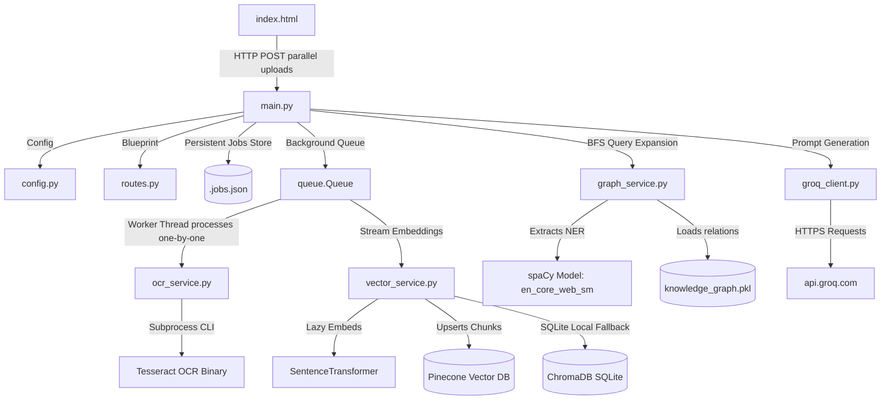
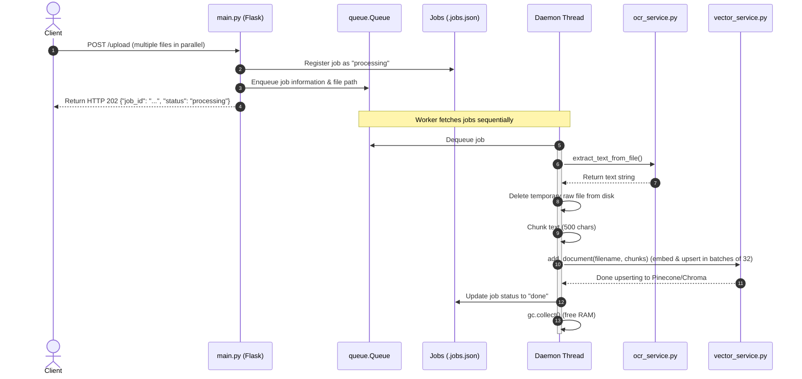
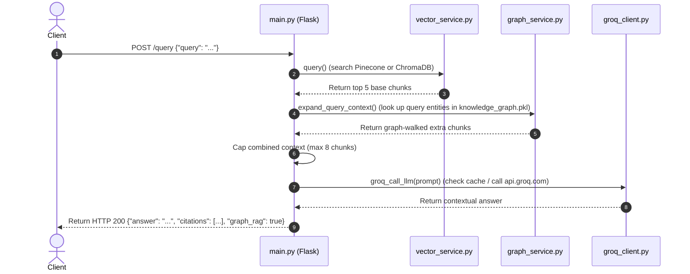

# Enterprise Technical Handover Handbook & Architecture Review
## Semantic Search System (Graph-RAG Document Intelligence Platform)

---

## 📋 Table of Contents
1. [Repository Discovery & Inventory](#1-repository-discovery--inventory)
2. [Project Understanding Report](#2-project-understanding-report)
3. [Dependency Mapping & Diagrams](#3-dependency-mapping--diagrams)
4. [Component & Codebase Analysis](#4-component--codebase-analysis)
5. [Runtime & Request Lifecycles](#5-runtime--request-lifecycles)
6. [Architectural Reconstruction](#6-architectural-reconstruction)
7. [Operational & Troubleshooting Guide](#7-operational--troubleshooting-guide)

---

## 1. Repository Discovery & Inventory

### 1.1. Directory Tree
```
SemanticSearchSystem/
├── .github/
│   └── workflows/
│       ├── main_handwrittenequationsolver.yml
│       └── main_semanticsearchsystem.yml
├── backend/
│   ├── app/
│   │   ├── services/
│   │   │   ├── __init__.py
│   │   │   ├── graph_service.py
│   │   │   ├── groq_client.py
│   │   │   ├── ocr_service.py
│   │   │   └── vector_service.py
│   │   ├── __init__.py
│   │   ├── config.py
│   │   ├── main.py
│   │   └── routes.py
│   ├── data/
│   │   ├── chroma_db/
│   │   │   └── chroma.sqlite3
│   │   ├── .gitkeep
│   │   ├── .jobs.json
│   │   └── knowledge_graph.pkl
│   └── __init__.py
├── frontend/
│   └── index.html
├── docs/
│   ├── deployment_guide.md
│   ├── documentation.md
│   └── summary.md
├── tests/
│   └── test_app.py
├── .env
├── .gitignore
├── Dockerfile
├── pytest.ini
├── railway.toml
├── README.md
├── render.yaml
└── requirements.txt
```

### 1.2. File Inventory

| File Path | Technology | Classification | Core Purpose |
| :--- | :--- | :--- | :--- |
| `backend/app/main.py` | Python / Flask | **Critical** | Server bootstrap, endpoint registration, background sequential queue worker thread. |
| `backend/app/config.py` | Python / dotenv | **Critical** | Environment configuration loading and variable normalization. |
| `backend/app/routes.py` | Python / Flask | **Important** | API blueprints registration and service health endpoints. |
| `backend/app/services/ocr_service.py` | Python / PyMuPDF / Tesseract | **Critical** | Text and layout parser for PDFs, DOCX, TXT, and Images at 150 DPI. |
| `backend/app/services/vector_service.py` | Python / Pinecone / Chroma | **Critical** | Handles SentenceTransformer embeddings and indexing within Pinecone (with Chroma local fallback). |
| `backend/app/services/graph_service.py` | Python / NetworkX / spaCy | **Critical** | Executes spaCy NER & prompts LLMs to extract KG relationships. |
| `backend/app/services/groq_client.py` | Python / Requests | **Critical** | Interface to Groq Cloud API; features rate-limit retry logic and caching. |
| `frontend/index.html` | HTML5 / CSS3 / JavaScript | **Critical** | Decoupled client UI with a fire-and-forget concurrent upload live dashboard and query viewer. |
| `tests/test_app.py` | Python / Pytest | **Important** | Functional test suite validating ingestion status, vector space search, and RAG routes. |
| `requirements.txt` | Pip Requirements | **Critical** | Declares standard dependencies and version locks. |

---

## 2. Project Understanding Report

### 2.1. Business Purpose
The **Semantic Search System** resolves organizational challenges associated with querying unstructured textual documents. Unlike regular pattern matching, this system builds a hybrid retrieval framework:
* **Dense Semantic Matching:** Mapping visual and textual documents into vector spaces.
* **Relational Context (Graph RAG):** Tracking entity interactions across documents using a local NetworkX Knowledge Graph.

### 2.2. Core Workflows
1. **Asynchronous Document Upload & Ingestion:**
   Files are posted in parallel to `/upload` (handled by [main.py](file:///d:/SemanticSearchSystem/backend/app/main.py)). The server registers each file in a disk-persisted job tracker (`.jobs.json`), enqueues it in a sequential `queue.Queue`, and immediately returns HTTP 202 to the frontend. A single background daemon thread processes files one at a time.
2. **Text Extraction & Cleanup:**
   The background worker extracts text from each file via PyMuPDF or Tesseract OCR (handled by [ocr_service.py](file:///d:/SemanticSearchSystem/backend/app/services/ocr_service.py)). OCR pages are rendered at **150 DPI** (reduced from 200 DPI to save ~44% RAM). The raw file is deleted from disk immediately after text extraction to keep disk footprint minimal.
3. **Low-Memory Vector Indexing:**
   Extracted text is split into 500-character chunks. The system lazy-loads the SentenceTransformer model and processes chunks in batches of 32. Chunks are embedded and upserted directly into **Pinecone** (or local ChromaDB SQLite if Pinecone credentials are not provided) via [vector_service.py](file:///d:/SemanticSearchSystem/backend/app/services/vector_service.py). To prevent OOM errors, vector lists are upserted immediately and garbage-collected, and Graph RAG ingestion (`knowledge_graph.add_document()`) is bypassed during file upload.
4. **Graph-Augmented Query Retrieval (Graph RAG):**
   When a user queries the system, it retrieves the top 5 vector matches. Simultaneously, [graph_service.py](file:///d:/SemanticSearchSystem/backend/app/services/graph_service.py) parses query entities using spaCy and walks 1-hop connections on the pre-loaded knowledge graph (restored from `knowledge_graph.pkl`). Any related chunk contexts are merged, capped at 8 total chunks, and sent to Groq (`llama-3.1-8b-instant`) to generate a cited response.

### 2.3. Explicit Assumptions
* **[ASSUMPTION 01] Single-Instance Threading:** The background processing queue relies on an in-memory python queue (`queue.Queue`) and a single daemon thread. The server must run on a single instance to guarantee that the queue remains intact and file processing remains strictly sequential.
* **[ASSUMPTION 02] Persistent Disk Storage:** Job statuses are written to `backend/data/.jobs.json` to survive container restarts. The server requires read/write access to this directory.

---

## 3. Dependency Mapping & Diagrams



* **External Cloud Boundaries:** `api.groq.com` (using `llama-3.1-8b-instant`) and Pinecone (serverless index).
* **Hugging Face Hub Dependencies:** Lazy-loads `sentence-transformers/all-MiniLM-L6-v2` at ingestion/query time.

---

## 4. Component & Codebase Analysis

### 4.1. Text Extraction Service ([ocr_service.py](file:///d:/SemanticSearchSystem/backend/app/services/ocr_service.py))
* **What It Is:** Text parser extracting string outputs from documents.
* **How It Works:** Parses text layers directly for text PDFs, DOCX, and TXT files. For images and scanned PDFs, pages are rendered into images at **150 DPI** and run through Tesseract OCR.
* **Optimizations:** Reduced DPI from 200 to 150, which cuts peak memory allocation and speeds up OCR processing by almost 2x.

### 4.2. Vector Storage Engine ([vector_service.py](file:///d:/SemanticSearchSystem/backend/app/services/vector_service.py))
* **What It Is:** Vector store interface managing semantic search operations.
* **How It Works:** Connects to Pinecone if `PINECONE_API_KEY` is configured; falls back to local ChromaDB otherwise.
* **Optimizations:** Encodes chunks in batches of 32 to cap peak memory. Discards vector arrays immediately after upserting to Pinecone.

### 4.3. Knowledge Graph Engine ([graph_service.py](file:///d:/SemanticSearchSystem/backend/app/services/graph_service.py))
* **What It Is:** NetworkX graph service enabling structural entity connection walks.
* **How It Works:** Traverses entities extracted from queries to discover 1-hop relationships from a serialized NetworkX DiGraph saved in `knowledge_graph.pkl`.
* **Optimizations:** Ingestion bypassed during document upload to prevent OOM RAM spikes and Groq API rate-limiting. Added a hard cap of 5,000 items in the chunk registry to prevent memory leaks.

### 4.4. Resilient LLM Gateway ([groq_client.py](file:///d:/SemanticSearchSystem/backend/app/services/groq_client.py))
* **What It Is:** HTTP client for the Groq API.
* **How It Works:** Direct communication with Groq APIs, utilizing a global cache `_llm_cache` to cache prompts. If rate-limited (HTTP 429), it parses the `Retry-After` header to sleep and retry.
* **Optimizations:** Reduced max retries to 3 for API stability, and automatically clears the cache if it grows beyond 200 items to avoid unbounded memory leaks.

---

## 5. Runtime & Request Lifecycles

### 5.1. Ingestion Pipeline Lifecycle


### 5.2. Search Pipeline Lifecycle


---

## 6. Architectural Reconstruction

### 6.1. Layer Interaction Overview
The decoupled client UI (`frontend/index.html`) uploads files directly and polls `/status/<job_id>`. The Flask Gateway manages the upload directory, enqueues ingestion jobs, and handles the query-time hybrid retrieval. Ingestion tasks run completely in the background, making the system highly responsive.

---

## 7. Operational & Troubleshooting Guide

### 7.1. Quick Start
```bash
# Install packages (with CPU-only PyTorch optimization)
pip install --no-cache-dir torch --index-url https://download.pytorch.org/whl/cpu
pip install -r requirements.txt

# Download NLP model
python -m spacy download en_core_web_sm

# Configure env variables (.env)
echo "GROQ_API_KEY=your_groq_key" > .env
echo "PINECONE_API_KEY=your_pinecone_key" >> .env
echo "PINECONE_INDEX_NAME=semantic-search-index" >> .env

# Run server
python backend/app/main.py
```

### 7.2. Troubleshooting Checklist
* **Jobs dashboard shows "Upload failed" or "Network error":** Ensure that the `BACKEND_URL` in `frontend/index.html` matches the domain of your backend API service (keep it empty if serving from the same host).
* **Ingestion status stuck in "Queued":** Ensure the Flask server was started with exactly 1 worker thread (or check that `use_reloader=False` is set) so the background queue thread is active.
* **Vector dimension mismatch on Pinecone (400 Bad Request):** Make sure your Pinecone index is set to exactly **384** dimensions.
* **Out-of-memory (OOM) crashes on Render:** Ensure you are using CPU-only PyTorch and have set the Gunicorn workers count to 1 with preload enabled.
* **Groq HTTP 429:** The client will automatically wait and retry. If errors persist, ensure duplicate prompts are hitting the in-memory cache correctly.
* **Tesseract Binary missing:** Ensure the `TESSERACT_CMD` environment variable is set in `.env` to point to the correct executable location.
